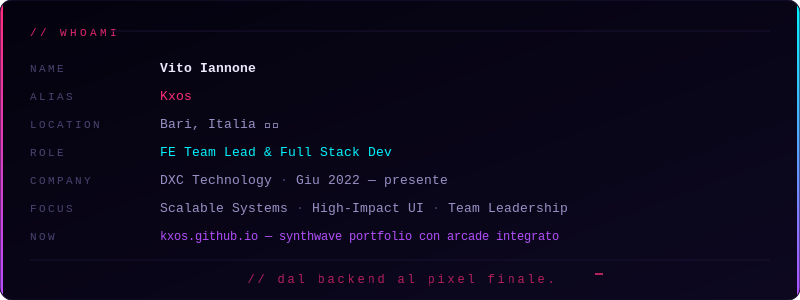
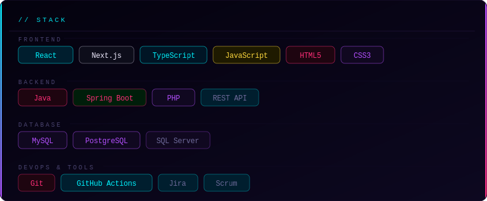

<!-- KXOS — GitHub Profile README · repo: Kxos/Kxos -->

 

 

&nbsp;
&nbsp;

 

 

 

 

 

  

 

 

<picture>
  <source media="(prefers-color-scheme: dark)"
    srcset="https://raw.githubusercontent.com/Kxos/Kxos/output/github-contribution-grid-snake-dark.svg"/>
  <source media="(prefers-color-scheme: light)"
    srcset="https://raw.githubusercontent.com/Kxos/Kxos/output/github-contribution-grid-snake.svg"/>
  
</picture>

 

